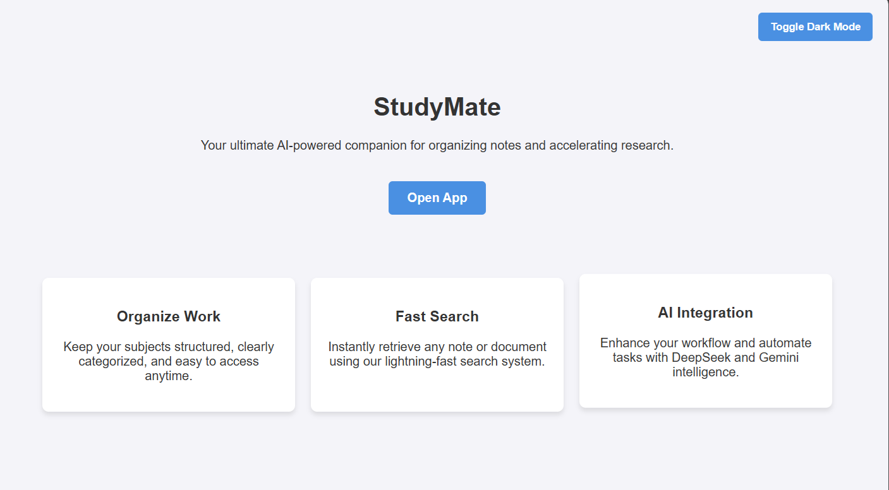

# StudyMate 📚🤖

## What is StudyMate?
StudyMate is a full-stack web application designed to help students organize their study materials. It allows users to create, view, search, and delete notes, featuring a powerful AI integration that automatically generates concise summaries and quiz questions using the DeepSeek API.

## Tech Stack
* **Frontend:** React, Vite, Axios
* **Backend:** Node.js, Express.js
* **Database:** MongoDB Atlas
* **AI Integration:** DeepSeek API (via OpenAI SDK)
* **Tools:** Model Context Protocol (MCP) SDK

## Setup Instructions

### 1. Server Setup (Backend)
Navigate to the server directory, install dependencies, and start the backend.

```bash
cd server
npm install
npm start
```

The server will run on `http://localhost:5000`.

### 2. Client Setup (Frontend)
Navigate to the client directory, install dependencies, and start the development server.

```bash
cd client
npm install
npm run dev
```

The frontend will be accessible at `http://localhost:5173`.

### 3. MCP Server Setup
Navigate to the MCP server directory, install dependencies, and launch the MCP Inspector to test the tools.

```bash
cd mcp-server
npm install
npx @modelcontextprotocol/inspector node index.js
```

## Environment Variables (.env)
For security, sensitive credentials (like database passwords and API keys) are never committed to version control.
 
You must manually create a `.env` file inside the `server` directory and add the required environment variables.

Create a new file named `.env` and add:

```env
PORT=5000
MONGO_URI=your_mongodb_connection_string_here
DEEPSEEK_API_KEY=your_deepseek_api_key_here


## Screenshots
* App UI

* MCP Tool Call
